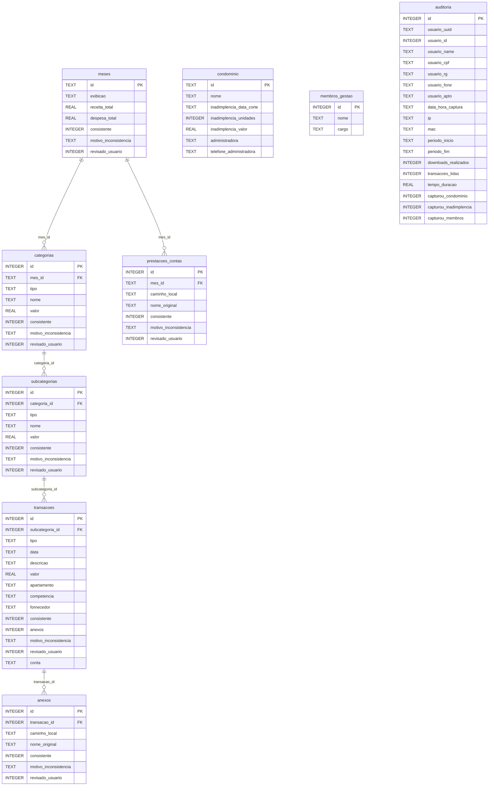

# Diagrama de Relacionamento do Banco de Dados

> [!NOTE]
> Banco de dados SQLite do projeto **Winker Scrapper**. As relações foram inferidas a partir das chaves estrangeiras presentes nos campos de cada tabela.

## Diagrama ER (Entidade-Relacionamento)



## Fluxo Hierárquico dos Dados

```
meses
 ├── categorias  (mes_id → meses.id)
 │    └── subcategorias  (categoria_id → categorias.id)
 │         └── transacoes  (subcategoria_id → subcategorias.id)
 │              └── anexos  (transacao_id → transacoes.id)
 └── prestacoes_contas  (mes_id → meses.id)

Tabelas independentes:
 ├── condominio      (dados cadastrais do condomínio)
 ├── membros_gestao  (membros da gestão do condomínio)
 └── auditoria       (log de acesso/captura dos dados)
```

## Resumo das Tabelas

| Tabela | PK | Tipo | Descrição |
|---|---|---|---|
| `meses` | `id` (TEXT) | Principal | Período mensal com totais de receita/despesa |
| `categorias` | `id` (INTEGER) | Dependente | Categorias financeiras por mês |
| `subcategorias` | `id` (INTEGER) | Dependente | Subcategorias dentro de uma categoria |
| `transacoes` | `id` (INTEGER) | Dependente | Transações financeiras individuais |
| `anexos` | `id` (INTEGER) | Dependente | Arquivos anexados às transações |
| `prestacoes_contas` | `id` (INTEGER) | Dependente | Documentos de prestação de contas por mês |
| `condominio` | `id` (TEXT) | Independente | Dados cadastrais do condomínio |
| `membros_gestao` | `id` (INTEGER) | Independente | Membros da gestão condominial |
| `auditoria` | `id` (INTEGER) | Independente | Log de auditorias e acessos |

## Observações

> [!TIP]
> - Todas as tabelas possuem campos `consistente`, `motivo_inconsistencia` e `revisado_usuario`, indicando um **sistema de validação de dados** transversal.
> - A tabela `auditoria` é um **log de sessão** de scraping, registrando o usuário, período e dados capturados.
> - A tabela `condominio` usa `id` como TEXT (possivelmente um slug ou código externo).
