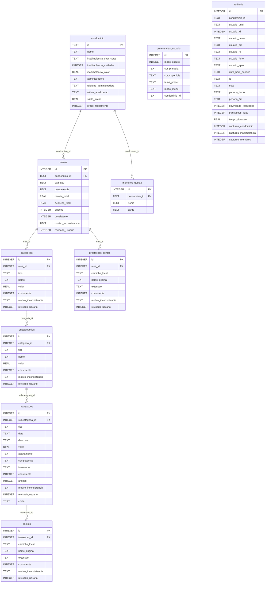

# Diagrama de Relacionamento do Banco de Dados

> [!NOTE]
> Banco de dados SQLite do projeto **Winker Scrapper**. O modelo relacional é gerenciado pelo ORM **Peewee** através da
> declaração de classes no arquivo `scripts/models.py`. O `ON DELETE CASCADE` garante integridade nativa nas chaves
> estrangeiras.

## Diagrama ER (Entidade-Relacionamento)



## Fluxo Hierárquico dos Dados

```
auditoria (Global)
preferencias_usuario (Global)
condominio  ← tabela raiz
 ├── meses
 │    ├── categorias
 │    │    └── subcategorias
 │    │         └── transacoes
 │    │              └── anexos
 │    └── prestacoes_contas
 └── membros_gestao
```

## Resumo das Tabelas

| Tabela                 | PK             | FK para            | Tipo       | Descrição                                    |
|------------------------|----------------|--------------------|------------|----------------------------------------------|
| `auditoria`            | `id` (INTEGER) | —                  | **Global** | Log de auditorias e acessos                  |
| `preferencias_usuario` | `id` (INTEGER) | —                  | **Global** | Configurações visuais do dashboard           |
| `condominio`           | `id` (TEXT)    | —                  | **Raiz**   | Dados cadastrais do condomínio               |
| `meses`                | `id` (INTEGER) | `condominio.id`    | Dependente | Período mensal com totais de receita/despesa |
| `categorias`           | `id` (INTEGER) | `meses.id`         | Dependente | Categorias financeiras por mês               |
| `subcategorias`        | `id` (INTEGER) | `categorias.id`    | Dependente | Subcategorias dentro de uma categoria        |
| `transacoes`           | `id` (INTEGER) | `subcategorias.id` | Dependente | Transações financeiras individuais           |
| `anexos`               | `id` (INTEGER) | `transacoes.id`    | Dependente | Arquivos anexados às transações              |
| `prestacoes_contas`    | `id` (INTEGER) | `meses.id`         | Dependente | Documentos de prestação de contas por mês    |
| `membros_gestao`       | `id` (INTEGER) | `condominio.id`    | Dependente | Membros da gestão condominial                |

## Observações

> [!IMPORTANT]
> - A tabela `condominio` é a **tabela raiz** do modelo de dados. Toda execução do scrapper deve preencher o
    condomínio antes de gravar dados nas tabelas dependentes.
> - `auditoria.condominio_id` é **opcional (NULL)**: o registro de auditoria é criado no início da execução, antes da
    extração do condomínio. O campo é atualizado assim que o ID é obtido.

> [!TIP]
> - Todas as tabelas possuem campos `consistente`, `motivo_inconsistencia` e `revisado_usuario`, indicando um **sistema
    de validação de dados** transversal.
> - A tabela `auditoria` é um **log de sessão** de scraping, registrando o usuário, período e dados capturados.
> - A tabela `condominio` usa `id` como TEXT (código de segurança extraído do portal Winker).
