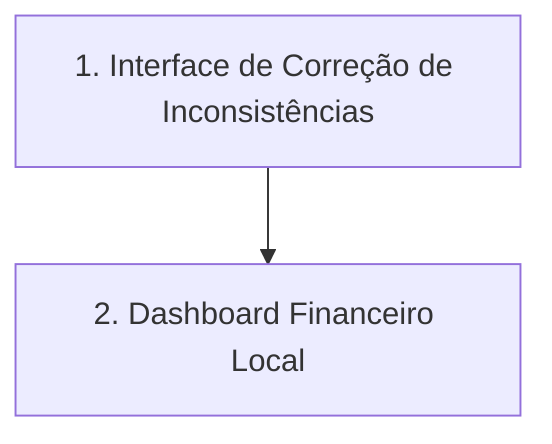

# Próximos Passos do Projeto Winker Scraper

Este documento foi atualizado para consolidar os marcos recentes de estabilidade e consistência e traçar os objetivos das próximas fases do projeto.

---

## 1. Conquistas e Marcos Recentes (Concluído)

* **Sincronismo Dinâmico e Fim das Instabilidades**: Substituição de todos os `time.sleep` estáticos por esperas inteligentes baseadas em estado (`locator.wait_for` e contagem de `ion-list`), eliminando a extração incorreta de 0 transações.
* **Mapeamento Transacional de Anexos**: Modificação da gravação física de anexos para ocorrer somente **após o sucesso do commit** no banco. Inclusão da limpeza prévia do diretório do mês para evitar arquivos órfãos ou duplicados.
* **Reprocessamento e Normalização de Anexos Históricos**: O reprocessamento manual dos meses target (incluindo `09/2025`, `03/2026`, `05/2026`, `12/2025`, `01/2026`, `02/2026`, `04/2026` e `06/2026`) foi 100% concluído com sucesso. Todos os anexos que estavam sem extensão no disco foram corrigidos e gravados com suas extensões adequadas, zerando a pendência de arquivos incompletos nesses períodos.
* **Auditoria de Consistência Retroativa e em Tempo de Execução**:
  * Criação da coluna `consistente` nas 4 tabelas do banco de dados.
  * Desenvolvimento do script [migrate_consistency.py](file:///C:/Users/steff/.gemini/antigravity-cli/brain/239e4ca8-b828-4900-a560-76ce349b7535/scratch/migrate_consistency.py) para auditoria histórica automática.
  * Validação no robô em tempo de execução com geração de avisos em console.
* **Regra Especial de Tarifas**: Implementação de regra para converter automaticamente despesas de `TARIFA COBRANÇA` para fornecedor `SICOOB` (e marcação automática de consistência), reduzindo em mais de 60% as inconsistências do banco histórico.
* **Controle de Fechamento de Console**: Inclusão de parada controlada (`input`) no encerramento do script para permitir a leitura completa dos logs.
* **Gerenciamento de Credenciais por `.env`**: Implementação de suporte para carregar automaticamente as credenciais `WINKER_USER`, `WINKER_PASSWORD` e `WINKER_CONDO` a partir do arquivo `.env` usando a biblioteca `python-dotenv`, mantendo os argumentos de linha de comando como prioridade máxima de sobressalência.

---

## 2. Próximos Passos Técnicos (Fase de Visualização e Ajustes)

Abaixo estão as próximas metas do projeto, ordenadas por prioridade:



### B. Interface para Correção Manual de Inconsistências
* **Objetivo**: Permitir tratar as transações que foram classificadas como inconsistentes (como os cashbacks, rendimentos e receitas sem competência na descrição).
* **Ação**:
  * Desenvolver uma pequena tela ou fluxo para listar registros com `consistente = 0`.
  * Permitir que o usuário insira manualmente os dados faltantes (ex: associar um apartamento ou competência ao cashback).
  * Salvar e recalcular a consistência do registro automaticamente.

### C. Dashboard de Visualização Financeira (Desktop App)
* **Objetivo**: Criar uma interface gráfica interativa de nível premium para analisar as finanças do condomínio.
* **Tecnologias Propostas**:
  * **Backend**: Python (com SQLite ativo)
  * **Frontend**: HTML5 + Vanilla CSS (Aesthetics Premium) + Chart.js / ApexCharts para gráficos dinâmicos.
  * **Wrapper Desktop**: `PyWebView` ou `Eel` (provendo empacotamento completo em janela nativa e desligamento automático ao fechar a janela).
* **Funcionalidades do Dashboard**:
  * KPIs superiores (Saldo Mensal, Total de Receitas, Total de Despesas, % de Inadimplência).
  * Gráfico de Linhas/Área de Receitas vs. Despesas ao longo dos meses.
  * Gráfico de Rosca/Pizza detalhando a fatia de despesa por categoria (Manutenção, Terceirização, Tarifas).
  * Tabela interativa para pesquisa de transações com filtro por mês, fornecedor ou categoria.
  * Indicador visual destacado para os meses ou transações que estão marcados como inconsistentes no banco.

### D. Extração Automática de Prestação de Contas Mensal (Novo)
* **Objetivo**: Baixar de forma automatizada o documento consolidado em PDF de prestação de contas de cada mês, emitido pela administradora.
* **Especificação Técnica Detalhada (Investigação e Validação Concluídas)**:
  1. **Navegação**: O robô deve alternar para a aba de prestação de contas do balancete utilizando o seletor `super-tab-button:has-text('PRESTAÇÃO DE CONTAS')` no iframe `pageIframe`.
  2. **Mapeamento do Mês**: Cada bloco de mês é delimitado por uma coluna `<ion-col>`. O localizador ideal para o mês desejado é:
     ```python
     col_locator = iframe.locator("ion-col").filter(has_text="Abril 2026")
     ```
  3. **Abertura do Menu de Ações**: Clicar no botão "VISUALIZAR" correspondente ao mês para abrir o modal de seleção:
     ```python
     col_locator.locator("button:has-text('VISUALIZAR')").click()
     ```
  4. **Estrutura do Menu (Action Sheet)**: O clique abre um elemento `ion-action-sheet` (classe `.action-sheet-md`) contendo duas opções principais:
     * Botão `"Visualizar"` (seletor: `button.action-sheet-button:has-text('Visualizar')`)
     * Botão `"Copiar link"` (seletor: `button.action-sheet-button:has-text('Copiar link')`)
  5. **Análise dos Links de Download**:
     * **Link Copiado**: O botão "Copiar link" envia para a área de transferência uma URL temporária no domínio do Winker, ex: `https://app.winker.com.br//file?token=68b0f49720ff3ba08a393f02303b2d6f`.
     * **Link Final**: Ao clicar em "Visualizar", a nova aba aberta é redirecionada para a URL final do PDF hospedado no sistema Condominizar, ex: `https://app.condominizar.com/api/integracao/anexo/download/<hash1>/<hash2>/Prestação de contas {MES}.pdf`.
  6. **Estratégia de Download (Playwright)**:
     * **Opção 1 (Interceptação de Popup - Recomendada)**: Interceptar a nova aba quando clicar em "Visualizar" no action-sheet:
       ```python
       with context.expect_page(timeout=15000) as new_page_info:
           frame.locator("button.action-sheet-button:has-text('Visualizar')").click()
       new_page = new_page_info.value
       # Aguardar o redirecionamento para obter a URL final
       target_url = ""
       start_time = time.time()
       while time.time() - start_time < 10.0:
           target_url = new_page.url
           if target_url and target_url.startswith("http") and "default/login" not in target_url:
               break
           time.sleep(0.1)
       new_page.close()
       ```
     * **Opção 2 (Requisição Direta por Token)**: Caso consigamos capturar a URL com token (ou mockando a API de clipboard do browser durante o clique no botão "Copiar link"), podemos fazer uma requisição GET direta para `https://app.winker.com.br//file?token=<token>`. O cliente HTTP do Playwright (`context.request.get`) segue automaticamente o redirecionamento e baixa o PDF bruto sem a necessidade de gerenciar popups.
  7. **Download e Validação**: Em ambos os métodos, efetuar o download usando o context HTTP do Playwright (`context.request.get(target_url)`), salvando o binário (retorno `status = 200`, `Content-Type = application/pdf` e cabeçalho mágico `%PDF-` validados).
  8. **Destino Local**: Salvar o arquivo PDF na mesma pasta dos anexos da transação do mês (`anexos/{chave_unica}/`) utilizando uma nomenclatura padronizada, por exemplo: `anexos/{chave_unica}/{chave_unica}_prestacao_contas.pdf` (ex: `anexos/202604/202604_prestacao_contas.pdf`).
  9. **Modelagem de Dados no Banco (Investigação e Proposta)**:
     Para manter a rastreabilidade do arquivo de prestação de contas no banco de dados `winker_data.db`, propõe-se duas abordagens de modelagem para avaliação posterior:
     * **Abordagem A (Coluna Adicional na tabela `meses`)**:
       * *Ação*: Adicionar a coluna `caminho_prestacao TEXT` (e opcionalmente `nome_original_prestacao TEXT`) diretamente na tabela existente `meses`.
       * *SQL*: `ALTER TABLE meses ADD COLUMN caminho_prestacao TEXT;`
       * *Prós*: Abordagem extremamente simples. Visto que cada mês possui apenas uma prestação de contas consolidada, o relacionamento 1:1 é perfeitamente atendido sem adicionar tabelas extras ou complexidade nas consultas SQL.
       * *Contras*: Rígido caso futuramente a administradora passe a liberar mais de um relatório consolidado de prestação de contas por mês (ex: relatórios complementares de auditorias ou anexos extras).
     * **Abordagem B (Nova tabela `prestacao_contas` - Recomendada para maior flexibilidade)**:
       * *Ação*: Criar uma tabela própria para prestação de contas vinculada à tabela `meses`.
       * *SQL*:
         ```sql
         CREATE TABLE IF NOT EXISTS prestacoes_contas (
             id INTEGER PRIMARY KEY AUTOINCREMENT,
             mes_id TEXT UNIQUE,
             caminho_local TEXT NOT NULL,
             nome_original TEXT,
             data_extracao TEXT,
             consistente INTEGER DEFAULT 1,
             FOREIGN KEY (mes_id) REFERENCES meses(id) ON DELETE CASCADE
         );
         ```
       * *Prós*: Mantém a semântica de dados limpa e separada. Se um mês no futuro tiver mais de um documento de prestação de contas, basta remover a restrição `UNIQUE` da coluna `mes_id` para permitir 1-para-N arquivos por mês.
       * *Contras*: Adiciona uma tabela a mais no banco de dados e exige junções (JOIN) nas consultas de listagem.

### E. Armazenamento do Motivo de Inconsistência no Banco (Concluído)
* **Objetivo**: Persistir a causa de uma inconsistência diretamente nas tabelas do banco de dados, simplificando exibições em dashboards e auditorias rápidas sem a necessidade de recalcular os motivos em tempo de execução.
* **Ações Executadas**:
  * **Migração e Retrofit JSON**: Criou-se e executou-se o script de migração [migrate_motivo_json.py](file:///C:/Users/steff/.gemini/antigravity-cli/brain/115c74fc-1307-4897-8580-f3bd8d727c2f/scratch/migrate_motivo_json.py) para converter os motivos pré-existentes nas 5 tabelas do banco (`meses`, `categorias`, `subcategorias`, `transacoes`, `anexos`) em listas estruturadas em formato de **Array JSON** (ex: `["Apartamento não identificado", "Competência não identificada"]`), permitindo a existência de múltiplos motivos por registro e viabilizando consultas SQL poderosas com funções nativas do SQLite (como `json_each`).
  * **Atualização do Robô**: Atualizou-se o robô [extract_winker.py](file:///D:/projects/winker/extract_winker.py) para que calcule, estruture e armazene automaticamente os motivos no formato de array JSON usando `json.dumps`.
  * **Atualização do Auditor**: Adaptou-se o script de auditoria [audit_consistency.py](file:///D:/projects/winker/audit_consistency.py) no diretório raiz do projeto para que leia as colunas de motivos e faça o parsing correto de JSON para gerar relatórios legíveis em [relatorio_consistencia.md](file:///D:/projects/winker/relatorio_consistencia.md).
  * **Exemplos de Consulta (`json_each`)**:
    Como a coluna `motivo_inconsistencia` armazena uma lista em formato JSON, consulte abaixo exemplos de como filtrar e agrupar esses motivos nativamente no SQLite:
    * *Filtrar transações com um motivo específico na lista:*
      ```sql
      SELECT t.id, t.descricao 
      FROM transacoes t, json_each(t.motivo_inconsistencia)
      WHERE json_each.value = 'Fornecedor não identificado';
      ```
    * *Agrupar e contar a quantidade de ocorrências por tipo de motivo individual:*
      ```sql
      SELECT json_each.value AS motivo, COUNT(*) AS total
      FROM transacoes t, json_each(t.motivo_inconsistencia)
      GROUP BY motivo
      ORDER BY total DESC;
      ```

### F. Validação de Regras de Extensão e Inconsistências de Anexos (Concluído)
* **Objetivo**: Garantir que o tratamento de extensões seja idêntico entre o salvamento físico no disco, os campos do banco de dados e as regras do validador, além de sanear arquivos com a extensão malformada `.PDF&H`.
* **Ações Executadas**:
  * **Investigação da Anomalia**: Descobriu-se que o parâmetro de hash da URL (`&H=...`) estava sendo interpretado como parte da extensão `.PDF&H` (de tamanho 5) porque a URL não continha o caractere `?` de query string antes do `&`, fazendo com que o `urlparse().path` incluísse o parâmetro.
  * **Correção no Script**: Modificou-se o robô [extract_winker.py](file:///D:/projects/winker/extract_winker.py) para limpar caracteres de parâmetros (`?` e `&`) do caminho da URL antes de extrair a extensão do arquivo.
  * **Saneamento do Banco e Disco**: Executou-se o script de saneamento histórico que renomeou fisicamente os 6 arquivos `.PDF&H` (meses `202505` e `202506`) no disco para `.pdf`, atualizou seus respectivos caminhos e nomes no banco `winker_data.db` e marcou a consistência deles como `1` (consistente).

---

## 3. Instruções de Leitura
> [!IMPORTANT]
> O banco de dados está estruturado e limpo. O saneamento de Maio/2026 está completo e 100% verificado. Recomendo a leitura destas metas para planejarmos o desenvolvimento do Dashboard e o controle das credenciais.
