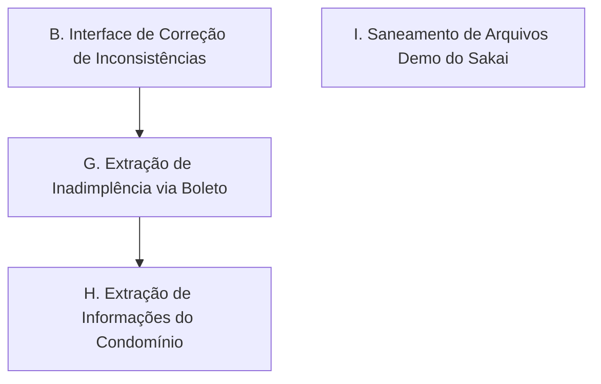

# Próximos Passos do Projeto Winker Scraper

Este documento consolida os marcos recentes de desenvolvimento e traça os objetivos ativos das próximas fases do projeto.

---

## 1. Conquistas e Marcos Recentes (Concluído)

* **Sincronismo Dinâmico e Fim das Instabilidades**: Implementação de esperas inteligentes (`locator.wait_for` e contagem de `ion-list`), eliminando a extração incorreta de 0 transações.
* **Consistência Automatizada e Regra de Tarifas**: Criação de regras de auditoria no banco de dados e normalização automática de despesas de `TARIFA COBRANÇA` para o fornecedor `SICOOB` (reduzindo em 60% as inconsistências).
* **Tratamento e Retrofit de Anexos**: Mapeamento físico seguro de arquivos de comprovantes e saneamento histórico das extensões malformadas (correção da extensão `.PDF&H` para `.pdf`).
* **Extração de Prestação de Contas Mensal (PDF)**: Download automatizado do relatório de prestação de contas no final de cada período e gravação estruturada com referência na tabela `prestacoes_contas`.
* **Dashboard Real em Sakai PrimeNG**: Frontend desktop em Angular v21 e PrimeNG v21 integrado via `pywebview` ao SQLite real, contendo cartões de KPIs e filtros avançados reativos.
* **Autogestão de Compilação & Banco**: O dashboard agora verifica a presença do banco local e monta/compila o Angular de forma autônoma na primeira execução se a pasta `compilados/` não for encontrada.
* **Reestruturação e Organização de Pastas**: Migração dos scripts executores para a pasta `scripts/`, o banco de dados SQLite para `database/` e a build para a raiz sob `compilados/`, mantendo a raiz limpa e documentada em um novo `README.md`.

---

## 2. Próximos Passos Técnicos (Fase de Visualização e Ajustes)

Abaixo estão as metas ativas do projeto, ordenadas por prioridade:

### B. Interface para Correção Manual de Inconsistências
* **Objetivo**: Permitir tratar as transações que foram classificadas como inconsistentes no banco de dados (como cashbacks e rendimentos que não possuem apartamento ou competência identificados).
* **Ação**:
  * Desenvolver uma tela simples no frontend para listar transações onde `consistente = 0`.
  * Permitir que o usuário insira manualmente os dados faltantes (ex: associar o apartamento ou a competência).
  * Gravar as correções e recalcular automaticamente o status de consistência do registro no banco.

### G. Extração de Inadimplência via Boleto Recente (Aguardando Liberação)
> [!IMPORTANT]
> **Status**: Esta funcionalidade está pausada aguardando o dia **01/07/2026**, data em que o novo boleto em aberto ficará disponível no portal, permitindo inspecionar e capturar a estrutura HTML de boletos não pagos.
* **Objetivo**: Extrair as estatísticas de inadimplência (unidades inadimplentes e valor total de débitos) a partir do PDF do boleto emitido mais recente.
* **Especificação Técnica**:
  1. **Navegação**: Acessar a página `https://app.winker.com.br/intra/meuCondominio/boleto` diretamente no frame principal.
  2. **Captura do Item**: Localizar o boleto mais recente usando a classe `.list-group-item` (`locator.first`).
  3. **Download**: Clicar na tag de badge do status (`a.badge` com título "Click para visualizar"), capturar a nova aba aberta do PDF e baixar o arquivo binário.
  4. **Leitura e Extração**: Utilizar Regex para ler o texto do PDF e capturar:
     * Data de corte: `Inadimplência do condomínio em (\d{2}/\d{2}/\d{4})`
     * Quantidade de unidades: `Unidades inadimplentes:\s*(\d+)`
     * Valor total em aberto: `Valor Total:\s*([\d.,]+)`
  5. **Modelagem**: Gravar os registros na nova tabela dedicada `inadimplencias`.

### H. Extração de Informações do Condomínio e Corpo Diretivo
* **Objetivo**: Extrair dados institucionais do condomínio e listagem dos integrantes do Corpo Diretivo ativo para exibição informativa no Dashboard.
* **Especificação Técnica**:
  1. **Navegação**: Acessar `https://app.winker.com.br/intra/condominio/sobre/index` no frame principal.
  2. **Código ID**: Capturar o ID de segurança do condomínio contido em `div.info_cond_codigo_seguranca strong`.
  3. **Nome do Condomínio**: Extrair do primeiro item da lista de breadcrumbs `#breadcrumb a`.
  4. **Corpo Diretivo**: 
     * Capturar o Síndico através da label `div.panel.panel-info > div.row label.label-success`.
     * Iterar sobre os outros membros em `#lista_corpo_diretivo .row` extraindo o nome do membro em `b i` e seu respectivo cargo adjacente.
  5. **Modelagem**: Salvar em tabelas de configuração e administração no banco SQLite.

### I. Saneamento e Limpeza de Arquivos de Demonstração (Dashboard)
* **Objetivo**: Deletar arquivos e pastas de demonstração e mocks do Sakai-NG para despoluir a pasta de código-fonte `dashboard/`.
* **Ações de Remoção**:
  1. **Dados de Teste**: Deletar diretórios [`dashboard/public/demo/`](file:///D:/projects/winker/dashboard/public/demo) e [`dashboard/src/assets/demo/`](file:///D:/projects/winker/dashboard/src/assets/demo).
  2. **Páginas Demo**: Deletar as subpastas em `dashboard/src/app/pages/` correspondentes a `uikit/`, `crud/`, `documentation/`, `empty/`, `landing/` e `auth/`.
  3. **Rotas**: Ajustar [`dashboard/src/app.routes.ts`](file:///D:/projects/winker/dashboard/src/app.routes.ts) para remover as rotas e imports lazy loading referentes a essas páginas excluídas.

---

## 3. Instruções de Leitura
> [!IMPORTANT]
> O banco de dados está estruturado e limpo. A pasta `scripts/` concentra a lógica ativa e `database/` armazena o SQLite local. Recomendo a leitura destas metas ativas para planejarmos o desenvolvimento da interface de conciliação.
